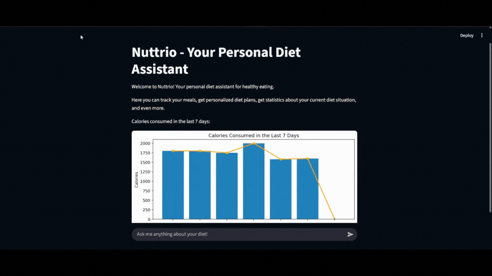

# Nuttrio

**Nuttrio — AI Agent for smarter diet tracking**

Nuttrio is a lightweight, privacy‑first application that helps people stay on top of their nutrition goals. Built with Streamlit and LangChain, it logs meals, tracks calories, and provides personalised feedback in real time — all while your data stays local.

---

## 🎬 Demo



---

## Table of Contents

1. [Features](#features)
2. [Quick Start](#quick-start)
3. [Configuration](#configuration)
4. [Project Structure](#project-structure)
5. [Tech Stack](#tech-stack)
6. [Roadmap](#roadmap)
7. [Contributing](#contributing)
8. [License](#license)

---

## Features

| Category         | Description                                                                          |
| ---------------- | ------------------------------------------------------------------------------------ |
| Meal logging     | Add meals manually or via search; values are stored in a local JSON database.        |
| Calorie tracking | Automatic daily energy balance with adjustable targets.                              |
| Smart coaching   | LangChain‑driven agent suggests food swaps and portion tweaks based on your history. |
| Privacy‑first    | All data lives on the user’s machine — no external database required.                |
| Extensible tools | JSON insert/search tools demonstrate how to plug in additional functionality.        |

---

## Quick Start

### Prerequisites

* Python **3.10+**
* (Optional) [poetry](https://python-poetry.org/) or `virtualenv`

```bash
# Clone the repo
$ git clone https://github.com/your‑org/nuttrio.git
$ cd nuttrio

# Create & activate a virtual environment
$ python -m venv .venv && source .venv/bin/activate  # Linux/macOS
# .venv\Scripts\activate  # Windows PowerShell

# Install dependencies
$ pip install -r requirements.txt
```

### Run locally

From root folder:
```bash
$ streamlit run app/app.py
```

Then open `http://localhost:8501` in your browser.

---

## Configuration

Create a `.env` file in the project root and add your keys:

```
TAVILY_API_KEY=tv‑...
```
The project comes pre‑configured to run a local Llama 3 model via Ollama.
---

## Project Structure

```text
nuttrio/
├── agent
│   ├── tools
│   │   ├── json_insert.py      # write calories to JSON DB
│   │   ├── json_search.py      # read calories from JSON DB
│   │   └── agent_init.py       # LangChain agent factory
│   └── prompts.py              # system & tool prompts
├── analysis
│   └── calories.py             # helper functions for nutrition analysis
├── app
│   └── app.py                  # Streamlit UI
├── db
│   ├── database.json           # local meal database
│   └── json_utils.py           # DB helpers
├── utils
│   └── __init__.py
├── main.py
├── requirements.txt            # Python dependencies
├── .env                        # environment variables (not committed)
└── README.md                   # you are here
```

---

## Tech Stack

* **Streamlit** – rapid prototyping of data apps
* **LangChain** – agent orchestration & tool calling
* **Python‑Dotenv** – environment variable management
* **JSON** – simple, human‑readable local storage
* **Pandas and matplotlib**

---

## Roadmap

* [ ] Macronutrient tracking (protein / carbs / fat)
* [ ] Photo‑based meal recognition (Food‑101 + CLIP)
* [ ] Daily summary e‑mails / push notifications
* [ ] SQLite backend with encryption
* [ ] Unit & integration test suite (pytest)

---

## Contributing

Pull requests are welcome! Please open an issue first to discuss major changes.

---

## License

Distributed under the **MIT License**. See `LICENSE` for more information.

---

> Built with ♥ to make healthy eating simpler.
